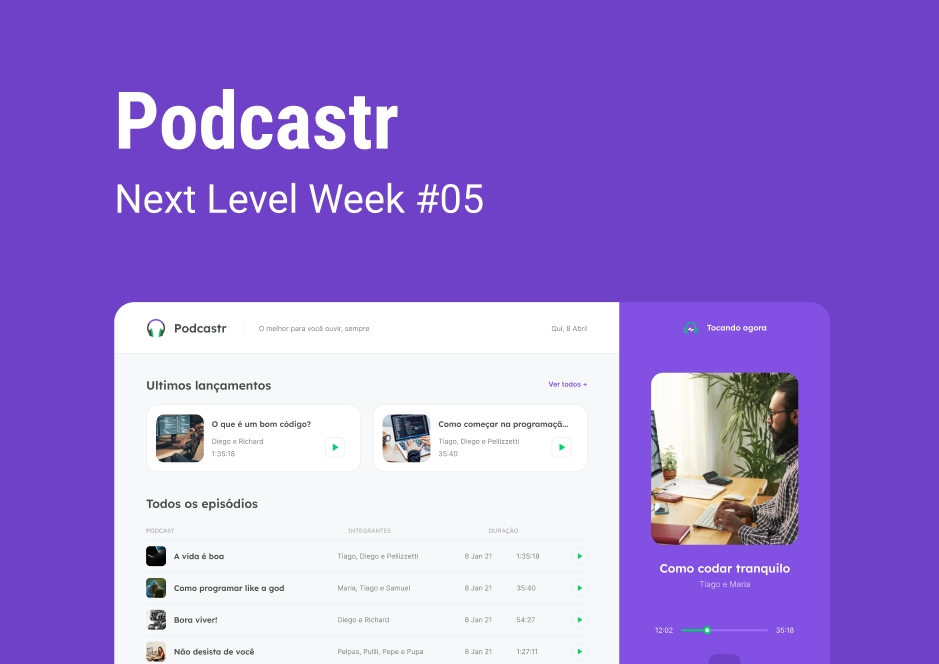

<h1 align="center">Podcastr</h1>



# 🔥️ Tecnologias

- NextJS
- ReactJS
- Typescript

# 🚀️ Iniciando o projeto

Primeiramente clone o projeto e acesse a pasta

```bash
$ git clone https://github.com/JonathaGomes/podcastr.git && cd podcastr
```

Após isso siga os passos abaixo

```bash
# Instalando as depedências do projeto
$ yarn

# Iniciando o projeto
$ yarn dev
```

# 💻️ Projeto

O Podcastr é uma aplicação para lhe aproximar você mais ainda do que há de melhor em podcasts de tecnologia! 💜️

# 🏷️ Layout

Você pode visualizar o layout do projeto [aqui](https://www.figma.com/file/MgFV7cEARBinibDQAZ7j4E/Podcastr?node-id=2%3A3)
É necessário ter uma conta no Figma

<hr>

<p align="center">Feito com 💜 by Jonatha Gomes</p>
